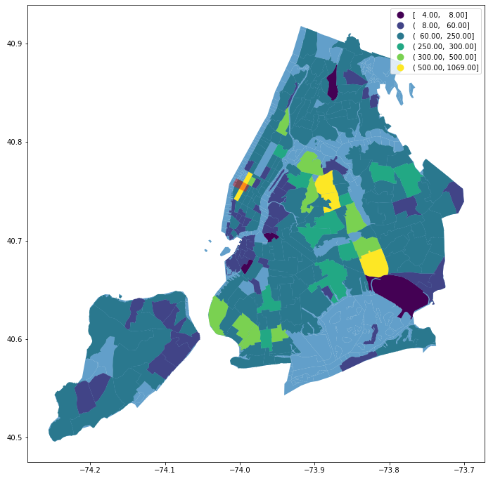

# art_of_engineering_course_smart_cities_project

# Introduction

Welcome to the Smart Cities project repository for the Art of Engineering course! In this course, we'll be exploring the exciting field of smart cities, which combines technology, data analysis, and urban planning to create more efficient and livable cities.

As part of this course, you'll be working on a small project that will give you hands-on experience with some of the tools and techniques used in smart cities. Specifically, you'll be using point of interest data to create maps and visualizations that can help us better understand urban environments.

To help you get started, we've provided some code snippets and data sets in this repository. These resources will give you a foundation to work from as you begin to explore the data and develop your own insights.

Throughout the project, you'll have the opportunity to collaborate with your classmates, share your findings, and receive feedback from your peers and instructors. We encourage you to take advantage of these opportunities to learn from each other and develop your skills as a data analyst and urban planner.

We hope that you find this project to be both challenging and rewarding, and we look forward to seeing the insights that you'll uncover as you work on it. Good luck, and have fun!

## Requirements
1) Python Installation: I want you to have python installed in your computer. If you do not have installed that yet follow the instruction below:
### For Mac:
Open a web browser and go to the official Python website at https://www.python.org/downloads/.
Click on the "Download Python" button located on the home page.
Scroll down and select the version of Python you want to download. We recommend downloading the latest stable version.
Click on the "macOS 64-bit installer" link to download the installation file.
Once the download is complete, open the installer file and follow the on-screen instructions to install Python on your Mac.

### For Windows:
Open a web browser and go to the official Python website at https://www.python.org/downloads/.
Click on the "Download Python" button located on the home page.
Scroll down and select the version of Python you want to download. We recommend downloading the latest stable version.
Click on the "Windows installer" link to download the installation file.
Once the download is complete, open the installer file and follow the on-screen instructions to install Python on your Windows machine.

Note that during the installation process, you may be asked to select certain configuration options such as adding Python to your system PATH or installing additional packages. You can choose the default options for most of these prompts, but make sure to read each one carefully to ensure that you are installing Python in the way that you want.

2) A text editor or IDE: You need a text editor or Integrated Development Environment (IDE) to open and edit the python files. My suggestion for Python development environment is Visual Studio Code.

3) Very basic programming knowledge: As with working in Jupyter Notebook, you will need a basic understanding of programming concepts such as variables, data types, control structures, and functions.

# Module 1
In module 1 we expect you to be able to successfully generate the following map using the provided data and shapefiles and following the provided step-by-step guideline.

### Step 1) Import function read_data from data_reader.py to read mobile phone data.

### Step 2) Import function read_grids from grid_reader.py to read grids/shapefiles.

You will read two shapefiles, Cencus Block Groups (CBGs) and taxi zones. Home locations of the visitors in the phone data are associated with cbgs. We will project them onto taxi zones. Because in next module our goal is to compare taxi users flow with visitors flow to Hudson Yards.

### Step 3) Extract mobile phone data of the visitors to the the destination of interest.

For our data analysis project our destination of interest is Hudson Yards.

### Step 4) Group/aggregate the visitors count by their home locations (origin of the trips).

For this you will import function count_visit from visit_counter.py.

### Step 5) Plot the distribution of origin/home location of visitors of Hudson yards.

You will see the pattern as the heat map in the figure below.

